# Responsiveness Audit Page Report

## Mzansi Eats - Food Delivery

## Screen Sizes Tested

* Mobile: 375px
* Tablet: 768px
* Desktop: 1280px

## Issue 1: Missing Viewport Meta Tag
**Description:** The HTML document did not have the standard viewport `<meta>` tag. Without this the mobile screen simulated a desktop screen width and zoom out, breaking the mobile experience entirely (noticeable on these two screen sizes: 375px and 768px).

**Screenshot 1:** 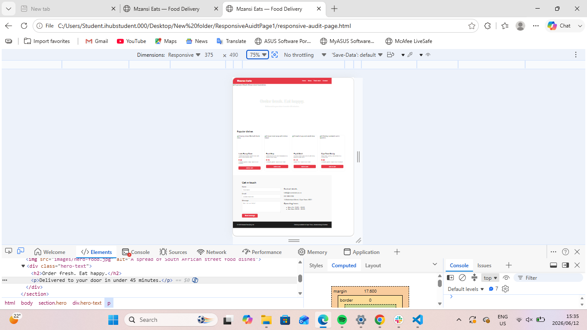
**Screenshot 2:** 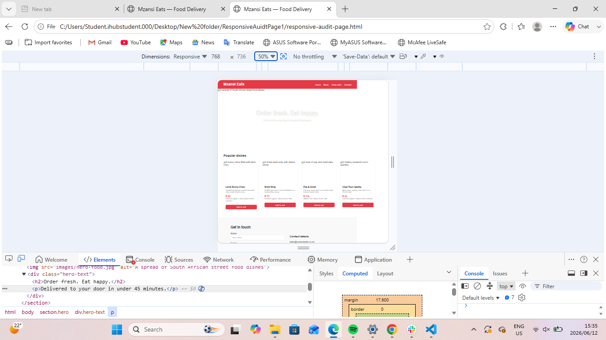

**Fix Applied:** I added `<meta name="viewport" content="width=device-width, initial-scale=1.0">` inside the `<head>` to ensure the browser strictly respects device widths.

**Updated Screenshot 1:** 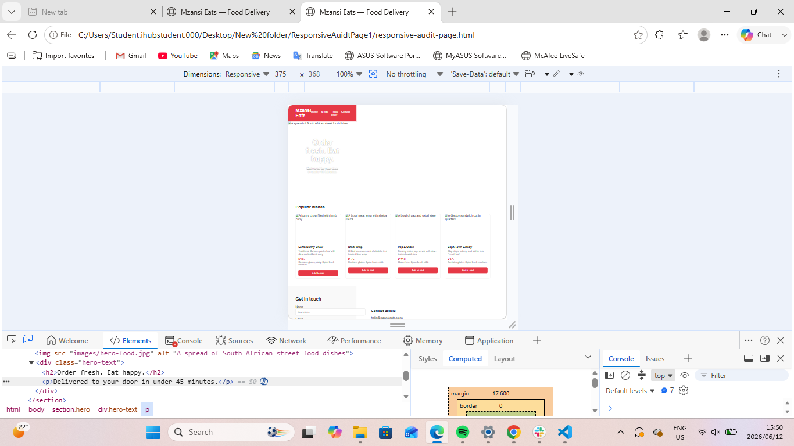
**Updated Screenshot 1:** 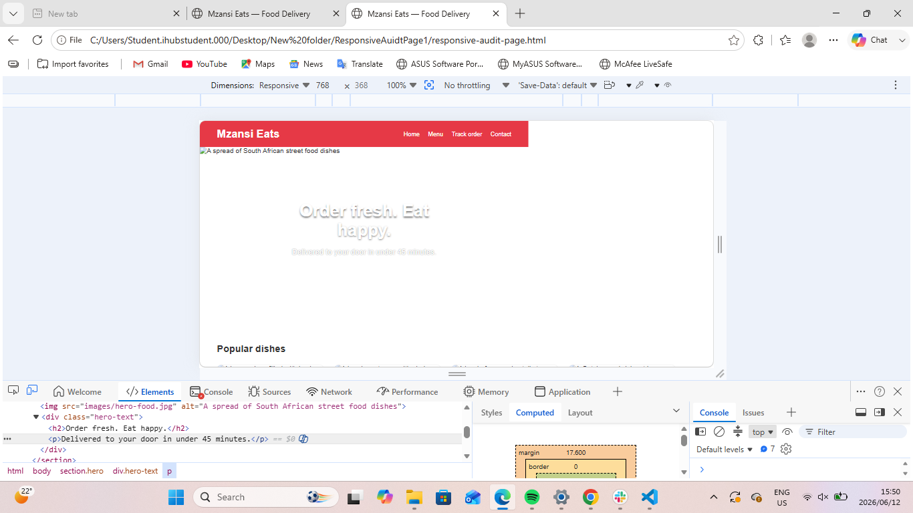

## Issue 2: Fixed Width on Hero Image
**Description:** The hero image has a `width: 1200px;`. At 375px and 768px, this causes horizontal scrolling and forces the page layout to expand beyond the device width.

**Screenshot 1:** 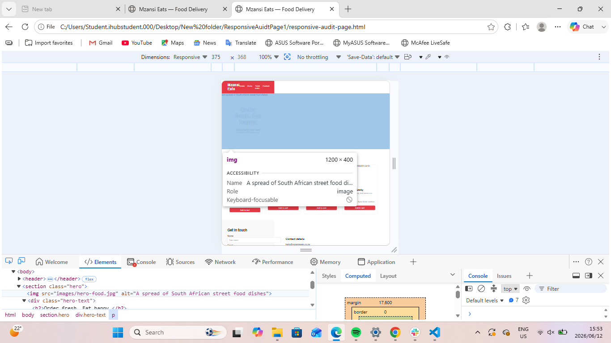
**Screenshot 2:** 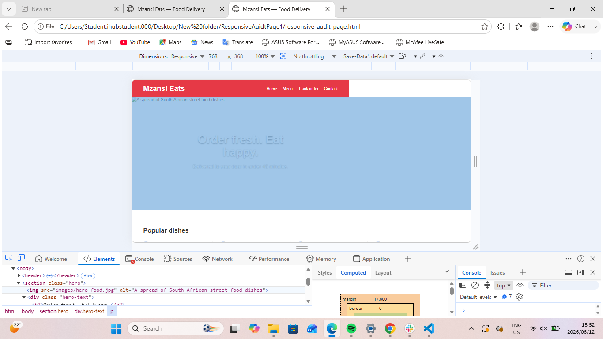

**Fix Applied:** I changed the width to `width: 100%;` so the image adapts to screen sizes.

**Updated Screenshot 1:** 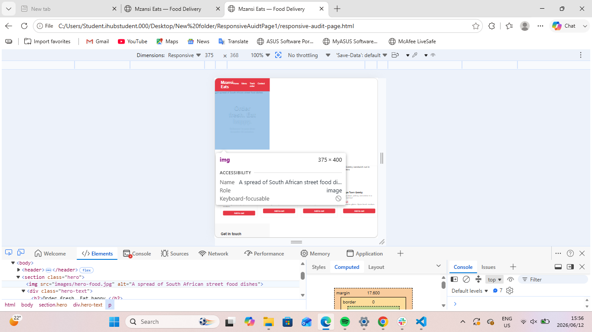
**Updated Screenshot 2:** 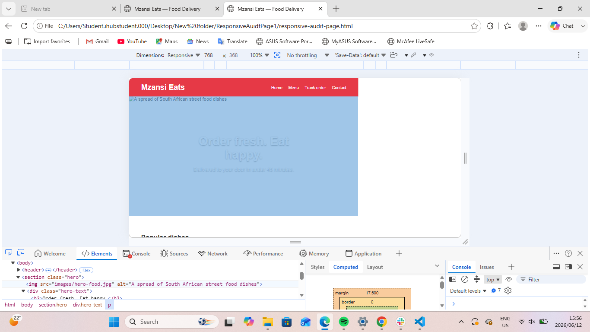

## Issue 3: Rigid Grid in the Menu Section
**Description:** The `.card-grid` class used `grid-template-columns: repeat(4, 250px);`. This requires at least 1000px plus grid gaps, creating a horizontal overflow on mobile and tablet views.

**Screenshot 1:** 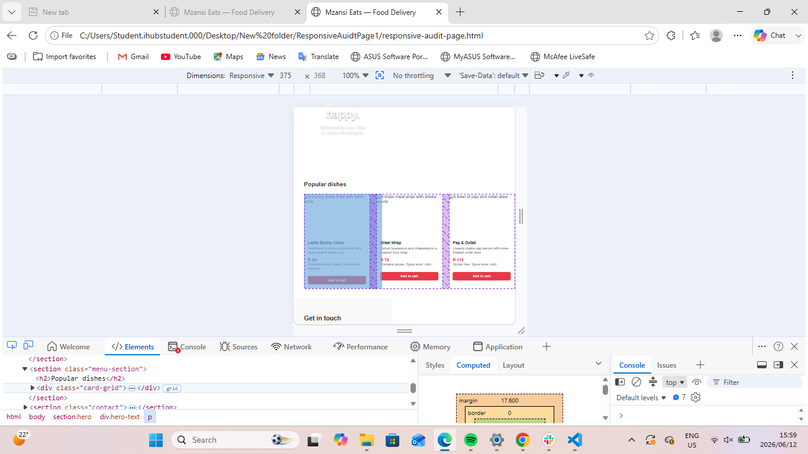
**Screenshot 2:** 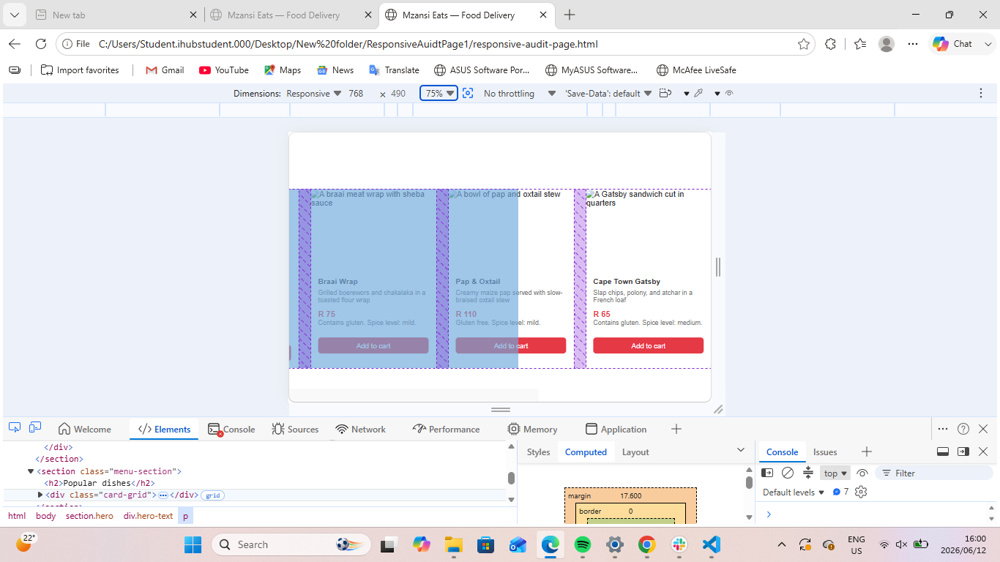

**Fix Applied:** I updated the grid using auto-fit and minmax: `grid-template-columns: repeat(auto-fit, minmax(250px, 1fr));`. This allows the grid to automatically drop to 2 columns on tablets, and 1 column on mobile screens without using media queries.

**Updated Screenshot 1:** 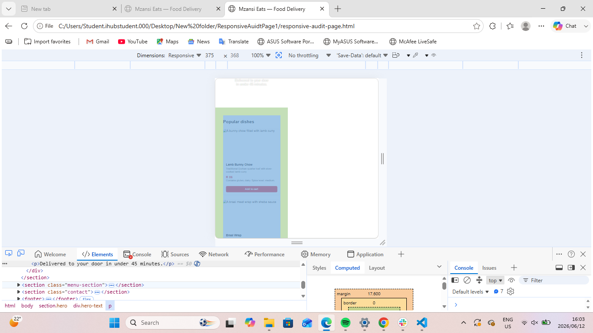
**Updated Screenshot 2:** 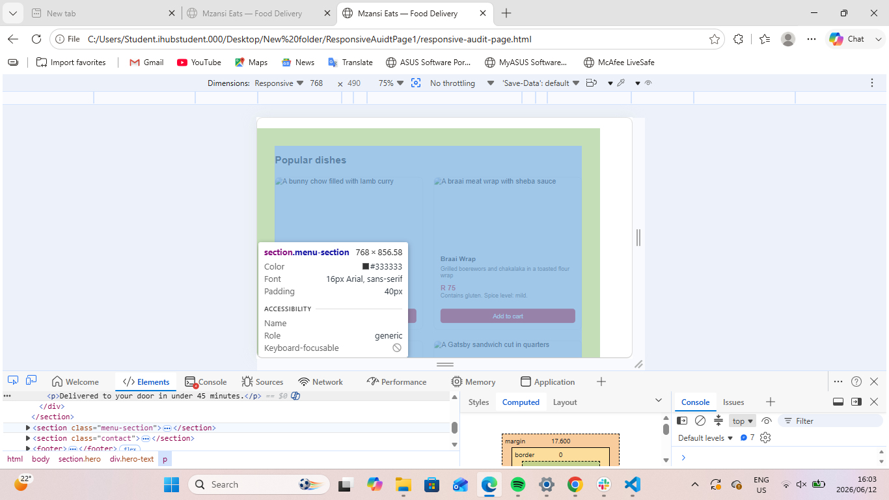

## Issue 4: Fixed Widths and Lacking Mobile Stack in Contact Section
**Description:** The `.contact-inner` had a `width: 800px;`, which is caused and causing mobile overflow. The `.contact-grid` also forces a two-column `1fr 1fr` layout, which will squash the form elements and text on mobile screen.

**Screenshot 1:** 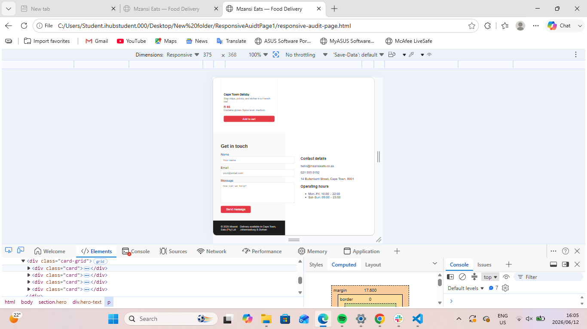
**Screenshot 2:** 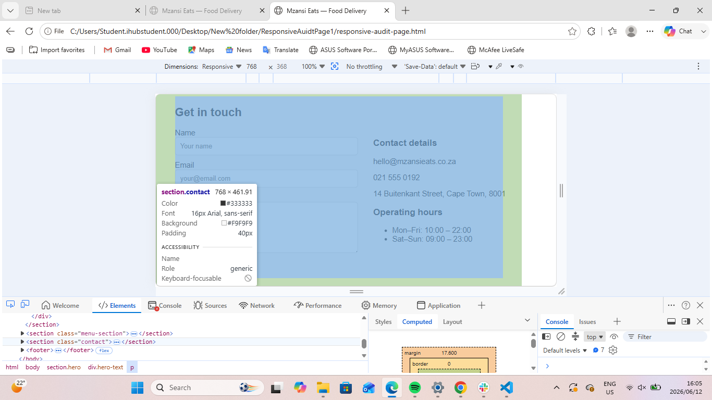

**Fix Applied:** I changed `.contact-inner` to `max-width: 800px; width: 100%;`. Added a media query at `max-width: 768px and 375px` to change the `.contact-grid` to a single column (`grid-template-columns: 1fr;`), allowing the form and text to stack neatly.

**Updated Screenshot:** 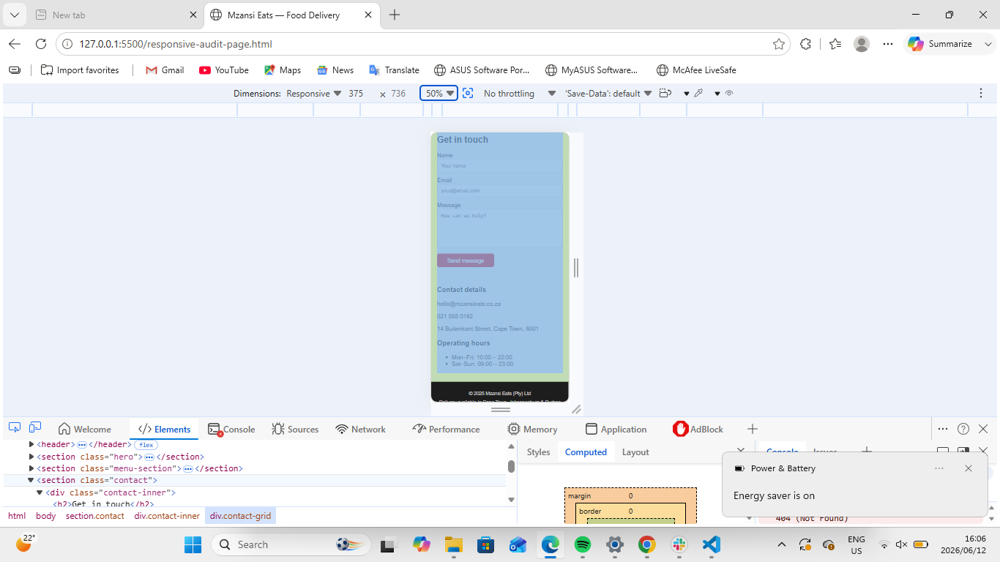
**Updated Screenshot:** 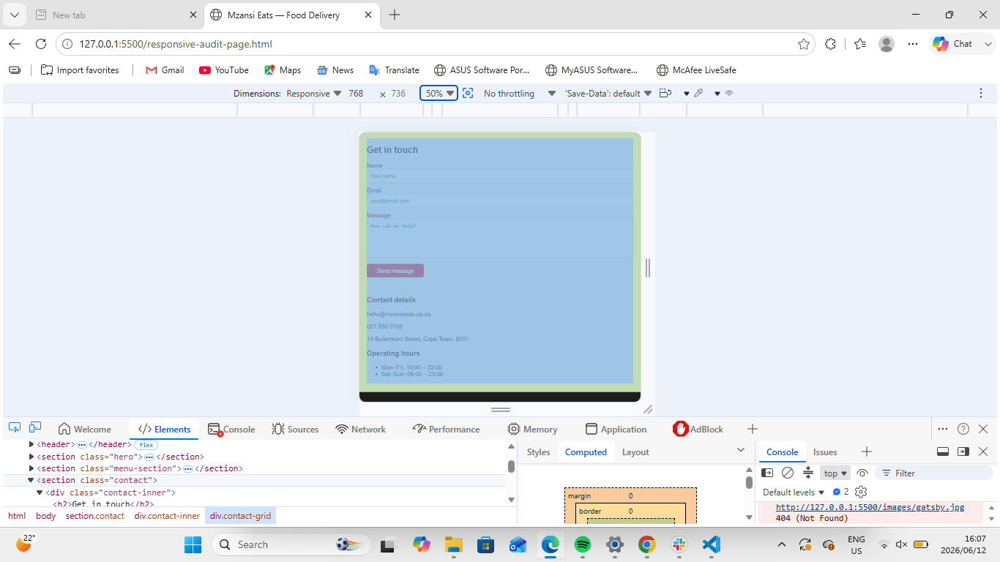

## Summary of Fixes

I tested the page at 375px, 768px, and 1280px using Chrome DevTools. I found responsiveness issues with the hero image, menu card grid, contact section, header, and footer. I fixed these problems using flexible widths, CSS Grid, Flexbox, and media queries. The page now adjusts better on mobile, tablet, and desktop screens.